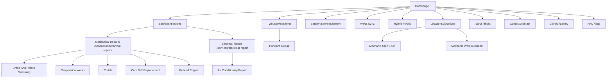

# Jalaram Auto Website Structure And Keyword Map

Status: Website structure working plan. Confirm services, pricing, assets, and compliance wording before publication.

Last updated: 4 August 2026.

## Strategic Summary

Jalaram Auto needs a local SEO website that makes five things obvious:

1. The workshop is a real local Glen Eden mechanic at 287C West Coast Road.
2. It handles everyday WOF, servicing, repairs, tyres, electrical, and air conditioning work.
3. Hybrid battery repair and reconditioning are the standout differentiators.
4. Trust is built through MTA approval, genuine reviews, Chirag's story, and photo-supported repair explanations.
5. The conversion path is simple: call, request a quote, or book a WOF/service.

The current structure should avoid a flat "all services" list. It should group pages around the way drivers search: urgent local mechanic needs, WOF, car service, hybrid battery issues, tyre punctures, and specific mechanical faults.

## Client-Requested Primary Navigation

Use this as the website menu direction from the client meeting follow-up:

- Home
- Services
  - Mechanical Repairs
    - Cam Belt Replacement
    - Brake And Rotors Skimming
    - Suspension Works
    - Clutch
    - Rebuild Engine
  - Electrical Repair
    - Air Conditioning Repair
- Tyre
  - Puncture Repair
- Battery
- WINZ
- Hybrid
- About
- Contact
- Gallery
- FAQ

Recommended header CTA:

- Call now
- Book a service

Optional top bar:

- 287C West Coast Road, Glen Eden
- 022 122 1822
- MTA approved
- Afterpay available, if confirmed
- Warranty/guarantee message, exact wording to confirm

## Page Hierarchy

```text
Homepage (/)
├── Services (/services)
│   ├── Mechanical Repairs (/services/mechanical-repairs)
│   │   ├── Cam Belt Replacement (/services/cam-belt-replacement)
│   │   ├── Brake And Rotors Skimming (/services/brake-and-rotors-skimming)
│   │   ├── Suspension Works (/services/suspension-works)
│   │   ├── Clutch (/services/clutch-repair)
│   │   └── Rebuild Engine (/services/rebuild-engine)
│   └── Electrical Repair (/services/electrical-repair)
│       └── Air Conditioning Repair (/services/air-conditioning-repair)
├── Tyre (/services/tyres)
│   └── Puncture Repair (/services/puncture-repair)
├── Battery (/services/battery)
├── WINZ (/winz)
├── Hybrid (/hybrid)
├── Locations (/locations)
│   ├── Mechanic Glen Eden (/mechanic-glen-eden)
│   └── Mechanic West Auckland (/mechanic-west-auckland)
├── About (/about)
├── Contact (/contact)
├── Gallery (/gallery)
├── FAQs (/faqs)
└── Reviews (/reviews)
```

## Visual Sitemap



## URL Map

| Page | URL | Parent | Nav Location | Priority |
| --- | --- | --- | --- | --- |
| Homepage | `/` | None | Header logo | High |
| Services Hub | `/services` | Homepage | Header | High |
| Mechanical Repairs | `/services/mechanical-repairs` | Services | Services dropdown | High |
| Cam Belt Replacement | `/services/cam-belt-replacement` | Mechanical Repairs | Services dropdown | Medium |
| Brake And Rotors Skimming | `/services/brake-and-rotors-skimming` | Mechanical Repairs | Services dropdown | Medium |
| Suspension Works | `/services/suspension-works` | Mechanical Repairs | Services dropdown | Medium |
| Clutch | `/services/clutch-repair` | Mechanical Repairs | Services dropdown | Medium |
| Rebuild Engine | `/services/rebuild-engine` | Mechanical Repairs | Services dropdown | Medium |
| Electrical Repair | `/services/electrical-repair` | Services | Services dropdown | High |
| Air Conditioning Repair | `/services/air-conditioning-repair` | Electrical Repair | Services dropdown | Medium |
| Tyre | `/services/tyres` | Homepage | Header | High |
| Puncture Repair | `/services/puncture-repair` | Tyre | Tyre dropdown | High |
| Battery | `/services/battery` | Homepage | Header | High |
| WINZ | `/winz` | Homepage | Header | High |
| Hybrid | `/hybrid` | Homepage | Header | High |
| WOF | `/services/wof` | Services | Services page / footer / contextual | High |
| Car Service | `/services/car-service` | Services | Services page / footer / contextual | High |
| Hybrid Battery Repair | `/services/hybrid-battery-repair` | Hybrid | Hybrid page links | High |
| Hybrid Battery Reconditioning | `/services/hybrid-battery-reconditioning` | Hybrid | Hybrid page links | High |
| Hybrid Car Service | `/services/hybrid-car-service` | Hybrid | Hybrid page links | Medium |
| Locations | `/locations` | Homepage | Footer | Medium |
| Mechanic Glen Eden | `/mechanic-glen-eden` | Locations | Header/footer/contextual | High |
| Mechanic West Auckland | `/mechanic-west-auckland` | Locations | Footer/contextual | High |
| Pricing | `/pricing` | Homepage | Footer/contextual | Medium |
| About | `/about` | Homepage | Header | High |
| Reviews | `/reviews` | Homepage | Header/footer | High |
| Contact | `/contact` | Homepage | Header CTA | High |
| Gallery | `/gallery` | Homepage | Header/footer | Medium |
| FAQ | `/faqs` | Homepage | Header/footer | Medium |

## Page Briefs

### Homepage

Recommended H1:

- Mechanic in Glen Eden for WOF, Servicing and Hybrid Battery Repairs

Primary keywords:

- mechanic Glen Eden
- Jalaram Auto
- WOF Glen Eden
- car service Glen Eden

Sections:

- Hero with Glen Eden location, MTA trust, phone CTA, and booking CTA.
- Service cards: WOF, car service, hybrid battery repair, mechanical repairs, tyres, auto electrical, air conditioning.
- Hybrid battery proof section explaining repair, reconditioning, rebuild, and replacement options in plain language.
- Why choose Jalaram Auto: genuine reviews, MTA approval, before/after photos, owner-led service, quality oil/parts.
- Starting-price teaser linking to `/pricing`.
- Glen Eden and West Auckland service-area section.
- Owner story preview with link to About.
- Reviews/testimonials.
- FAQ.

CTA:

- Call Jalaram Auto
- Book a WOF or service
- Ask about hybrid battery repair

### Services Hub

Target page: `/services`

Primary keyword:

- car repairs Glen Eden

Sections:

- Service overview grouped by customer need.
- WOF and servicing.
- Hybrid repairs.
- Mechanical repairs.
- Tyres and puncture repair.
- Auto electrical and air conditioning.
- "Not sure what your car needs?" quote CTA.

### WOF

Target page: `/services/wof`

Primary keyword:

- WOF Glen Eden

Sections:

- What a WOF inspection covers.
- What happens if the car passes.
- What happens if the car fails.
- WOF repairs and recheck pathway.
- MTA/authorisation trust wording after confirmation.
- Glen Eden location and booking CTA.

### Car Service

Target page: `/services/car-service`

Primary keyword:

- car service Glen Eden

Sections:

- Basic service.
- Full service.
- Hybrid car servicing.
- Sedan/hatchback starting price after approval.
- SUV starting price after approval.
- Quality oil and parts.
- Service records and reminders.
- CTA to request a quote by make/model.

### Hybrid Battery Repair

Target page: `/services/hybrid-battery-repair`

Primary keyword:

- hybrid battery repair Auckland

Secondary keywords:

- hybrid battery repair West Auckland
- hybrid battery repair near me
- hybrid battery replacement Auckland
- hybrid battery service near me

Sections:

- Symptoms of hybrid battery problems.
- Diagnosis process.
- Repair versus reconditioning versus replacement.
- Common hybrid vehicles, if confirmed.
- Why Jalaram Auto for hybrid battery work.
- Quote CTA.
- Link to `/services/hybrid-battery-reconditioning` and `/services/hybrid-car-service`.

### Hybrid Battery Reconditioning

Target page: `/services/hybrid-battery-reconditioning`

Primary keyword:

- hybrid battery reconditioning

Sections:

- What reconditioning means in simple terms.
- When it can be suitable.
- When replacement may be better.
- Safety and testing.
- Cost range or starting-price guidance after approval.
- CTA for diagnosis.

### Mechanical Repairs

Target page: `/services/mechanical-repairs`

Primary keyword:

- mechanical repairs Glen Eden

Sections:

- Cam belt replacement.
- Brake and rotors skimming.
- Suspension works.
- Clutch.
- Rebuild engine / engine-related work.
- Photo-supported diagnosis.
- Quote-before-repair trust message.

Child pages:

- `/services/cam-belt-replacement`
- `/services/brake-and-rotors-skimming`
- `/services/suspension-works`
- `/services/clutch-repair`
- `/services/rebuild-engine`

### Electrical Repair

Target page: `/services/electrical-repair`

Primary keyword:

- electrical repair Glen Eden

Sections:

- Electrical diagnosis.
- Warning lights and vehicle electrical issues.
- Battery/alternator/starter-related issues, if confirmed.
- Air conditioning repair as the key child service.
- Quote CTA.

### Air Conditioning Repair

Target page: `/services/air-conditioning-repair`

Primary keyword:

- air conditioning repair Glen Eden

Sections:

- Air conditioning inspection.
- Regas, leak testing, and repair scope after confirmation.
- Symptoms: warm air, weak airflow, smell, noise, leaks.
- Pricing and warranty terms after client confirmation.
 
### Battery

Target page: `/services/battery`

Primary keyword:

- car battery Glen Eden

Sections:

- Standard battery testing and replacement, if confirmed.
- Auxiliary battery support, if confirmed.
- Hybrid battery pathway linking to `/hybrid`.
- Battery warning-light diagnosis.
- Warranty/guarantee terms after confirmation.

### WINZ

Target page: `/winz`

Primary keyword:

- WINZ car repairs Auckland

Sections:

- Explain that customers may be able to request a written quote for WINZ support, exact process to confirm.
- Services commonly quoted: WOF repairs, mechanical repairs, tyres, battery, and urgent safety repairs.
- What the customer needs before work starts.
- Payment approval rules and disclaimers.
- Call/request quote CTA.

### Hybrid

Target page: `/hybrid`

Primary keyword:

- hybrid mechanic West Auckland

Sections:

- Hybrid battery repair.
- Hybrid battery reconditioning.
- Hybrid battery rebuild/replacement options.
- Hybrid servicing.
- Symptoms of hybrid battery issues.
- Warranty/guarantee terms after confirmation.
- Links to `/services/hybrid-battery-repair`, `/services/hybrid-battery-reconditioning`, and `/services/hybrid-car-service`.

### Tyres

Target page: `/services/tyres`

Primary keyword:

- tyres Glen Eden

Sections:

- New tyres.
- Tyre checks.
- Puncture repair.
- When a tyre cannot be repaired.
- Link to `/services/puncture-repair`.

### Puncture Repair

Target page: `/services/puncture-repair`

Primary keyword:

- puncture repair Glen Eden

Sections:

- Repairable tread-area punctures.
- Sidewall damage is not repairable.
- Safety check.
- Quote/visit CTA.
- Add clear photo or diagram of repairable tyre area.

### Mechanic Glen Eden

Target page: `/mechanic-glen-eden`

Primary keyword:

- mechanic Glen Eden

Sections:

- Local mechanic positioning.
- WOF, car service, hybrid battery repair, tyres, repairs.
- Address and nearby landmarks.
- Reviews and MTA proof.
- Links to service pages.
- Contact CTA.

### Mechanic West Auckland

Target page: `/mechanic-west-auckland`

Primary keyword:

- mechanic West Auckland

Sections:

- West Auckland service-area overview.
- Glen Eden workshop as the physical location.
- Henderson, Kelston, New Lynn, Avondale, Titirangi, Glendene, Green Bay, Sunnyvale, and nearby suburbs.
- Core services and hybrid differentiator.
- CTA.

## Navigation Spec

Header nav:

- Home
- Services
- Tyre
- Battery
- WINZ
- Hybrid
- About
- Contact
- Gallery
- FAQ

Header CTA:

- Call now

Services dropdown:

- Mechanical Repairs
  - Cam Belt Replacement
  - Brake And Rotors Skimming
  - Suspension Works
  - Clutch
  - Rebuild Engine
- Electrical Repair
  - Air Conditioning Repair

Tyre dropdown:

- Puncture Repair

Footer columns:

- Services: Mechanical Repairs, Cam Belt Replacement, Brake And Rotors Skimming, Suspension Works, Clutch, Rebuild Engine, Electrical Repair, Air Conditioning Repair.
- Specialist: Tyre, Puncture Repair, Battery, WINZ, Hybrid, WOF, Car Service.
- Locations: Mechanic Glen Eden, Mechanic West Auckland, Henderson, New Lynn, Kelston, Titirangi.
- Trust: About, Gallery, FAQ, Reviews, MTA Approved, Afterpay, Guarantee.
- Contact: Phone, Address, Hours, Booking/Quote form.

Breadcrumbs:

- Home > Services > Mechanical Repairs > Cam Belt Replacement
- Home > Services > Electrical Repair > Air Conditioning Repair
- Home > Tyre > Puncture Repair
- Home > Hybrid > Hybrid Battery Repair
- Home > Locations > Mechanic Glen Eden

## Internal Linking Plan

Hub pages:

- `/services` should link to every core service page.
- `/services/mechanical-repairs` should link to cam belt replacement, brake and rotors skimming, suspension works, clutch, rebuild engine, WOF, and car service.
- `/services/electrical-repair` should link to air conditioning repair, battery, and contact.
- `/services/tyres` should link to puncture repair, WOF, and contact.
- `/services/battery` should link to hybrid, electrical repair, pricing, and contact.
- `/winz` should link to mechanical repairs, WOF, tyre, battery, and contact.
- `/hybrid` should link to hybrid battery repair, hybrid battery reconditioning, hybrid car service, pricing, reviews, and contact.
- `/mechanic-glen-eden` should link to WOF, car service, hybrid battery repair, mechanical repairs, tyres, reviews, and contact.

Cross-section links:

- WOF page links to mechanical repairs and tyres for failed inspection fixes.
- Car service page links to hybrid car service and mechanical repairs.
- Hybrid pages link to reviews and gallery once assets exist.
- WINZ page links to the services most likely to need written quotes.
- Battery page links to Hybrid where the issue is hybrid-specific.
- About page links to MTA trust, reviews, and hybrid services.
- Pricing page links to WOF, car service, hybrid battery repair, puncture repair, and quote form.

No orphan pages:

- Every page in the URL map must be linked from either the header, footer, parent service page, location page, or related-service section.

## Recommended Launch Phasing

### Phase 1: Core Local SEO Site

- Homepage
- Services hub
- Mechanical Repairs
- Electrical Repair
- Air Conditioning Repair
- Tyre
- Puncture Repair
- Battery
- WINZ
- Hybrid
- Mechanic Glen Eden
- About
- Contact
- Gallery
- FAQs

### Phase 2: Service Expansion

- WOF
- Car Service
- Hybrid Battery Repair
- Hybrid Battery Reconditioning
- Hybrid Car Service
- Cam Belt Replacement
- Brake And Rotors Skimming
- Suspension Works
- Clutch
- Rebuild Engine
- Mechanic West Auckland
- Pricing
- Reviews

### Phase 3: Content And Suburb Expansion

- Hybrid battery educational articles.
- WOF and servicing guides.
- Henderson, New Lynn, Kelston, and Titirangi suburb pages only if data supports them.
- Competitor comparison pages only after strategy approval.

## Schema Recommendations

- LocalBusiness / AutoRepair on homepage and location pages.
- AutomotiveBusiness where supported by implementation stack.
- FAQPage on service FAQ sections.
- BreadcrumbList on all pages below homepage.
- Review snippets only if compliant with Google review and structured-data policies.

## Do Not Include At Launch

- Wheel alignment.
- Major panel beating.
- Thin suburb doorway pages.
- Unapproved fixed prices.
- Unverified "only provider in Glen Eden" claims.
- Unapproved insurance or warranty guarantees.
