# Jalaram Auto Website Structure And Keyword Map

Status: Website structure working plan. Client supplied core pricing on 10 August 2026. Confirm remaining services, GST wording, assets, and compliance wording before publication.

Last updated: 10 August 2026.

## Strategic Summary

Jalaram Auto needs a local SEO website that makes five things obvious:

1. The workshop is a real local Glen Eden mechanic at 287C West Coast Road.
2. It handles everyday WOF, servicing, repairs, tyres, electrical, and air conditioning work.
3. Hybrid battery repair and reconditioning are the standout differentiators.
4. Trust is built through MTA approval, genuine reviews, Chirag's story, and photo-supported repair explanations.
5. The conversion path is simple: call, request a quote, or book a WOF/service.

The current structure should avoid a flat "all services" list. It should group pages around the way drivers search: urgent local mechanic needs, WOF, car service, hybrid battery issues, tyre punctures, and specific mechanical faults.

## Client-Requested Primary Navigation

Use this as the website menu direction from the client meeting follow-up:

- Home Page
- Services
  - Service Packages
  - Car Mechanical Repairs
    - Brake and Rotor Skimming
    - Suspension Works
    - Cam Belt Replacement
    - Clutch Works
    - Engine Rebuild
  - Auto Electrical
    - Auto Electrical Repairs
    - Air Conditioning
- Hybrid Repairs
   - Hybrid Battery Repair
   - Hybrid Car Service
- Battery Services
   - Buy New Batteries
- Tyres
  - New Tyres
  - Puncture Repair
- WOF
- WINZ
- Gallery
- About
- Contact
- FAQ

Menu notes:

- Service Packages must be a direct menu item with no dropdown.
- Use "Auto Electrical Repairs" as the public menu label. Keep "auto electrician repair" as a keyword phrase in page copy where natural.
- Keep WINZ support, battery pricing, gallery/photos, reviews, and trust proof in page content and footer/contextual links unless the client later asks to restore them as header items.

Recommended header CTA:

- Call now
- Book a service

Optional top bar:

- 287C West Coast Road, Glen Eden
- 022 122 1822
- MTA approved
- Afterpay available, if confirmed
- Warranty/guarantee message, exact wording to confirm

## Page Hierarchy

```text
Homepage (/)
├── Service Packages (/service-packages)
├── Hybrid Repair (/hybrid-repair)
│   ├── Hybrid Battery Repair (/hybrid-repair/hybrid-battery-repair)
│   ├── Buy New Batteries (/hybrid-repair/buy-new-batteries)
│   └── Hybrid Car Service (/hybrid-repair/hybrid-car-service)
├── Mechanical Repair (/mechanical-repair)
│   ├── Brake and Rotor Skimming (/mechanical-repair/brake-and-rotor-skimming)
│   ├── Suspension Works (/mechanical-repair/suspension-works)
│   ├── Cam Belt Replacement (/mechanical-repair/cam-belt-replacement)
│   ├── Clutch Works (/mechanical-repair/clutch-works)
│   └── Engine Rebuild (/mechanical-repair/engine-rebuild)
├── Auto Electrical Repairs (/auto-electrical-repairs)
│   └── Air Conditioning (/auto-electrical-repairs/air-conditioning)
├── Tyres (/tyres)
│   ├── New Tyres (/tyres/new-tyres)
│   └── Puncture Repair (/tyres/puncture-repair)
├── Warrant of Fitness (WOF) (/warrant-of-fitness-wof)
├── Windscreen (/windscreen)
├── Locations (/locations)
│   ├── Mechanic Glen Eden (/mechanic-glen-eden)
│   └── Mechanic West Auckland (/mechanic-west-auckland)
├── About (/about)
├── Contact (/contact)
└── General FAQ (/general-faq)
```

## Visual Sitemap

```mermaid
graph TD
    HOME["Homepage /"] --> PACKAGES["Service Packages /service-packages"]
    HOME --> HYBRID["Hybrid Repair /hybrid-repair"]
    HOME --> MECH["Mechanical Repair /mechanical-repair"]
    HOME --> ELECTRICAL["Auto Electrical Repairs /auto-electrical-repairs"]
    HOME --> TYRES["Tyres /tyres"]
    HOME --> WOF["Warrant of Fitness WOF /warrant-of-fitness-wof"]
    HOME --> WINDSCREEN["Windscreen /windscreen"]
    HOME --> LOCATIONS["Locations /locations"]
    HOME --> ABOUT["About /about"]
    HOME --> CONTACT["Contact /contact"]
    HOME --> FAQ["General FAQ /general-faq"]

    HYBRID --> HYBRIDBATTERY["Hybrid Battery Repair"]
    HYBRID --> NEWBATTERIES["Buy New Batteries"]
    HYBRID --> HYBRIDSERVICE["Hybrid Car Service"]

    MECH --> BRAKES["Brake and Rotor Skimming"]
    MECH --> SUSPENSION["Suspension Works"]
    MECH --> CAMBELT["Cam Belt Replacement"]
    MECH --> CLUTCH["Clutch Works"]
    MECH --> ENGINE["Engine Rebuild"]

    ELECTRICAL --> AC["Air Conditioning"]

    TYRES --> NEWTYRES["New Tyres"]
    TYRES --> PUNCTURE["Puncture Repair"]

    LOCATIONS --> GLENEDEN["Mechanic Glen Eden"]
    LOCATIONS --> WESTAKL["Mechanic West Auckland"]
```



## URL Map

| Page | URL | Parent | Nav Location | Priority |
| --- | --- | --- | --- | --- |
| Homepage | `/` | None | Header logo | High |
| Service Packages | `/service-packages` | Homepage | Header | High |
| Hybrid Repair | `/hybrid-repair` | Homepage | Header | High |
| Hybrid Battery Repair | `/hybrid-repair/hybrid-battery-repair` | Hybrid Repair | Hybrid Repair dropdown | High |
| Buy New Batteries | `/hybrid-repair/buy-new-batteries` | Hybrid Repair | Hybrid Repair dropdown | High |
| Hybrid Car Service | `/hybrid-repair/hybrid-car-service` | Hybrid Repair | Hybrid Repair dropdown | Medium |
| Mechanical Repair | `/mechanical-repair` | Homepage | Header | High |
| Brake and Rotor Skimming | `/mechanical-repair/brake-and-rotor-skimming` | Mechanical Repair | Mechanical Repair dropdown | High |
| Suspension Works | `/mechanical-repair/suspension-works` | Mechanical Repair | Mechanical Repair dropdown | Medium |
| Cam Belt Replacement | `/mechanical-repair/cam-belt-replacement` | Mechanical Repair | Mechanical Repair dropdown | Medium |
| Clutch Works | `/mechanical-repair/clutch-works` | Mechanical Repair | Mechanical Repair dropdown | Medium |
| Engine Rebuild | `/mechanical-repair/engine-rebuild` | Mechanical Repair | Mechanical Repair dropdown | Medium |
| Auto Electrical Repairs | `/auto-electrical-repairs` | Homepage | Header | High |
| Air Conditioning | `/auto-electrical-repairs/air-conditioning` | Auto Electrical Repairs | Auto Electrical Repairs dropdown | High |
| Tyres | `/tyres` | Homepage | Header | High |
| New Tyres | `/tyres/new-tyres` | Tyres | Tyres dropdown | High |
| Puncture Repair | `/tyres/puncture-repair` | Tyres | Tyres dropdown | High |
| Warrant of Fitness (WOF) | `/warrant-of-fitness-wof` | Homepage | Header | High |
| Windscreen | `/windscreen` | Homepage | Header | Medium |
| Locations | `/locations` | Homepage | Footer | Medium |
| Mechanic Glen Eden | `/mechanic-glen-eden` | Locations | Header/footer/contextual | High |
| Mechanic West Auckland | `/mechanic-west-auckland` | Locations | Footer/contextual | High |
| About | `/about` | Homepage | Header | High |
| Contact | `/contact` | Homepage | Header CTA | High |
| General FAQ | `/general-faq` | Homepage | Header/footer | Medium |
| WINZ Quote Support | `/winz` | Homepage | Footer/contextual | Medium |
| Reviews | `/reviews` | Homepage | Footer/contextual | Medium |
| Gallery | `/gallery` | Homepage | Footer/contextual | Medium |

## Page Briefs

### Homepage

Recommended H1:

- Mechanic in Glen Eden for WOF, Servicing and Hybrid Battery Repairs

Primary keywords:

- mechanic Glen Eden
- Jalaram Auto
- WOF Glen Eden
- car service Glen Eden

Sections:

- Hero with Glen Eden location, MTA trust, phone CTA, and booking CTA.
- Service cards: WOF, car service, hybrid battery repair, mechanical repairs, tyres, auto electrical, air conditioning.
- Hybrid battery proof section explaining repair, reconditioning, rebuild, and replacement options in plain language.
- Why choose Jalaram Auto: genuine reviews, MTA approval, before/after photos, owner-led service, quality oil/parts.
- Starting-price teaser linking to `/pricing`, using client-supplied prices.
- Glen Eden and West Auckland service-area section.
- Owner story preview with link to About.
- Reviews/testimonials.
- FAQ.

CTA:

- Call Jalaram Auto
- Book a WOF or service
- Ask about hybrid battery repair

### Service Packages

Target page: `/service-packages`

Primary keyword:

- car service Glen Eden

Sections:

- Basic service package.
- Full service package.
- Hybrid car service package.
- Diesel car service package.
- Standard car basic service from `$120 plus GST`.
- SUV basic service from `$150`, GST wording to confirm.
- Van/ute basic service from `$180`, GST wording to confirm.
- Standard car full service from `$200 plus GST`.
- SUV full service from `$250 plus GST`.
- Hybrid car service from `$120 plus GST` up to 4 litres oil.
- Diesel car service from `$180 plus GST` up to 4 litres oil.
- What is included in Basic Service.
- What is included in Full Service.
- CTA to request a quote by make/model.

### WOF

Target page: `/warrant-of-fitness-wof`

Primary keyword:

- WOF Glen Eden

Sections:

- What a WOF inspection covers.
- What happens if the car passes.
- What happens if the car fails.
- WOF repairs and recheck pathway.
- MTA/authorisation trust wording after confirmation.
- Glen Eden location and booking CTA.

### Windscreen

Target page: `/windscreen`

Primary keyword:

- windscreen repair Glen Eden

Sections:

- Confirm whether Jalaram Auto handles windscreen chip repair, replacement, leak repair, wiper-related checks, or referral support.
- Explain what customers should do if a windscreen issue affects WOF.
- Quote CTA once service scope and pricing are confirmed.

### General FAQ

Target page: `/general-faq`

Primary keyword:

- mechanic FAQ Glen Eden

Sections:

- WOF questions.
- Service package questions.
- Hybrid battery repair and battery replacement questions.
- Tyre and puncture repair questions.
- Payment questions, including Afterpay and WINZ support after wording is confirmed.
- Guarantee and warranty questions after wording is confirmed.

### Hybrid Battery Repair

Target page: `/hybrid-repair/hybrid-battery-repair`

Primary keyword:

- hybrid battery repair Auckland

Secondary keywords:

- hybrid battery repair West Auckland
- hybrid battery repair near me
- hybrid battery replacement Auckland
- hybrid battery service near me

Sections:

- Symptoms of hybrid battery problems.
- Diagnosis process.
- Repair versus reconditioning versus replacement.
- Common hybrid vehicles, if confirmed.
- Why Jalaram Auto for hybrid battery work.
- Quote CTA.
- Link to `/hybrid-repair/buy-new-batteries` and `/hybrid-repair/hybrid-car-service`.

### Buy New Batteries

Target page: `/hybrid-repair/buy-new-batteries`

Primary keyword:

- hybrid battery replacement Auckland

Sections:

- Brand-new hybrid batteries are available.
- Price depends on vehicle make and model.
- Explain when a new battery may be better than repair or reconditioning.
- Secondhand hybrid battery options start from `$600`, GST wording to confirm.
- Compare new, secondhand, reconditioned, and repaired battery options.
- Safety and testing.
- CTA for diagnosis.

### Mechanical Repair

Target page: `/mechanical-repair`

Primary keyword:

- mechanical repairs Glen Eden

Sections:

- Cam belt replacement.
- Brake and rotors skimming.
- Suspension works.
- Clutch works.
- Engine rebuild / engine-related work.
- Photo-supported diagnosis.
- Quote-before-repair trust message.
- Diagnostic scan `$50 incl. GST`.
- Labour `$95` per hour, GST wording to confirm.
- Brake pads from `$120 plus GST`.
- Rotor skimming from `$150 plus GST`.

Child pages:

- `/mechanical-repair/brake-and-rotor-skimming`
- `/mechanical-repair/suspension-works`
- `/mechanical-repair/cam-belt-replacement`
- `/mechanical-repair/clutch-works`
- `/mechanical-repair/engine-rebuild`

### Auto Electrical Repairs

Target page: `/auto-electrical-repairs`

Primary keyword:

- electrical repair Glen Eden

Sections:

- Electrical diagnosis.
- Warning lights and vehicle electrical issues.
- Battery/alternator/starter-related issues, if confirmed.
- Air conditioning as the key child service.
- Quote CTA.

### Air Conditioning

Target page: `/auto-electrical-repairs/air-conditioning`

Primary keyword:

- air conditioning repair Glen Eden

Sections:

- Air conditioning inspection.
- A/C gas refill from `$150`, GST wording to confirm.
- A/C gas leak test from `$80`, GST wording to confirm.
- Vacuum test from `$95`, GST wording to confirm.
- Compressor oil fill from `$45`, GST wording to confirm.
- Symptoms: warm air, weak airflow, smell, noise, leaks.
- Warranty terms after client confirmation.
 
### Battery Support

Target page: contextual section, footer link, or future page if client requests it in header navigation.

Primary keyword:

- car battery Glen Eden

Sections:

- Auxiliary battery test free.
- Auxiliary battery from `$180`, GST wording to confirm, with 3-year warranty.
- Standard battery testing and replacement pricing to confirm.
- Hybrid battery pathway linking to `/hybrid-repair`.
- Battery warning-light diagnosis.
- Warranty/guarantee terms after confirmation.

### WINZ

Target page: `/winz`

Primary keyword:

- WINZ car repairs Auckland

Sections:

- Free WINZ quotations.
- Services commonly quoted: WOF repairs, mechanical repairs, tyres, battery, and urgent safety repairs.
- What the customer needs before work starts.
- Payment approval rules and disclaimers.
- Call/request quote CTA.

### Hybrid Repair

Target page: `/hybrid-repair`

Primary keyword:

- hybrid mechanic West Auckland

Sections:

- Hybrid battery repair.
- Hybrid battery reconditioning.
- Hybrid battery rebuild/replacement options.
- Hybrid servicing.
- Hybrid car service from `$120 plus GST` up to 4 litres oil.
- Hybrid battery health check `$70`, GST wording to confirm.
- Hybrid battery reconditioning from `$750`, GST wording to confirm.
- Secondhand hybrid battery from `$600`, GST wording to confirm; price depends on make/model.
- Brand-new hybrid batteries available; price depends on make/model.
- Symptoms of hybrid battery issues.
- Warranty/guarantee terms after confirmation.
- Links to `/hybrid-repair/hybrid-battery-repair`, `/hybrid-repair/buy-new-batteries`, and `/hybrid-repair/hybrid-car-service`.

### Tyres

Target page: `/tyres`

Primary keyword:

- tyres Glen Eden

Sections:

- New tyres.
- Tyre checks.
- Puncture repair.
- Tyres from `$85`, GST wording to confirm.
- Tyre balancing `$25` per tyre, GST wording to confirm.
- Tyre disposal fee from `$6.65` per tyre, GST wording to confirm.
- Brands include Bridgestone, Ceat, Zeta, Roadx, Black Hawk, Hi-Fily, King Boss, EV tyres, and more.
- When a tyre cannot be repaired.
- Link to `/tyres/new-tyres` and `/tyres/puncture-repair`.

### New Tyres

Target page: `/tyres/new-tyres`

Primary keyword:

- new tyres Glen Eden

Sections:

- Tyres from `$85`, GST wording to confirm.
- Tyre balancing `$25` per tyre, GST wording to confirm.
- Tyre disposal fee from `$6.65` per tyre, GST wording to confirm.
- Brands include Bridgestone, Ceat, Zeta, Roadx, Black Hawk, Hi-Fily, King Boss, EV tyres, and more.
- EV tyre availability.
- Quote CTA by size, brand preference, and vehicle make/model.

### Puncture Repair

Target page: `/tyres/puncture-repair`

Primary keyword:

- puncture repair Glen Eden

Sections:

- Repairable tread-area punctures.
- Sidewall damage is not repairable.
- Puncture repair from `$40`, GST wording to confirm.
- Safety check.
- Quote/visit CTA.
- Add clear photo or diagram of repairable tyre area.

### Mechanic Glen Eden

Target page: `/mechanic-glen-eden`

Primary keyword:

- mechanic Glen Eden

Sections:

- Local mechanic positioning.
- WOF, car service, hybrid battery repair, tyres, repairs.
- Address and nearby landmarks.
- Reviews and MTA proof.
- Links to service pages.
- Contact CTA.

### Mechanic West Auckland

Target page: `/mechanic-west-auckland`

Primary keyword:

- mechanic West Auckland

Sections:

- West Auckland service-area overview.
- Glen Eden workshop as the physical location.
- Henderson, Kelston, New Lynn, Avondale, Titirangi, Glendene, Green Bay, Sunnyvale, and nearby suburbs.
- Core services and hybrid differentiator.
- CTA.

## Navigation Spec

Header nav:

- Home Page
- Service Packages
- Hybrid Repair
- Mechanical Repair
- Auto Electrical Repairs
- Tyres
- Warrant of Fitness (WOF)
- Windscreen
- About
- Contact
- General FAQ

Header CTA:

- Call now

Service Packages dropdown:

- None. This item links directly to `/service-packages`.

Hybrid Repair dropdown:

- Hybrid Battery Repair
- Buy New Batteries
- Hybrid Car Service

Mechanical Repair dropdown:

- Brake and Rotor Skimming
- Suspension Works
- Cam Belt Replacement
- Clutch Works
- Engine Rebuild

Auto Electrical Repairs dropdown:

- Air Conditioning

Tyres dropdown:

- New Tyres
- Puncture Repair

Footer columns:

- Services: Service Packages, Mechanical Repair, Brake and Rotor Skimming, Suspension Works, Cam Belt Replacement, Clutch Works, Engine Rebuild.
- Specialist: Hybrid Repair, Hybrid Battery Repair, Buy New Batteries, Hybrid Car Service, Auto Electrical Repairs, Air Conditioning, Tyres, New Tyres, Puncture Repair, WOF, Windscreen.
- Locations: Mechanic Glen Eden, Mechanic West Auckland, Henderson, New Lynn, Kelston, Titirangi.
- Trust: About, General FAQ, Reviews, Gallery, MTA Approved, Afterpay, Guarantee, WINZ quote support.
- Contact: Phone, Address, Hours, Booking/Quote form.

Breadcrumbs:

- Home > Mechanical Repair > Cam Belt Replacement
- Home > Auto Electrical Repairs > Air Conditioning
- Home > Tyres > Puncture Repair
- Home > Hybrid Repair > Hybrid Battery Repair
- Home > Hybrid Repair > Buy New Batteries
- Home > Locations > Mechanic Glen Eden

## Internal Linking Plan

Hub pages:

- `/service-packages` should link to WOF, hybrid car service, mechanical repair, tyres, and contact.
- `/hybrid-repair` should link to hybrid battery repair, buy new batteries, hybrid car service, service packages, reviews, and contact.
- `/mechanical-repair` should link to brake and rotor skimming, suspension works, cam belt replacement, clutch works, engine rebuild, WOF, and service packages.
- `/auto-electrical-repairs` should link to air conditioning, battery support, and contact.
- `/tyres` should link to new tyres, puncture repair, WOF, and contact.
- `/winz` should link contextually to mechanical repair, WOF, tyres, battery support, and contact.
- `/mechanic-glen-eden` should link to WOF, service packages, hybrid battery repair, mechanical repair, tyres, reviews, and contact.

Cross-section links:

- WOF page links to mechanical repairs and tyres for failed inspection fixes.
- Service Packages page links to hybrid car service and mechanical repairs.
- Hybrid pages link to reviews and gallery once assets exist.
- WINZ page links to the services most likely to need written quotes.
- Battery page links to Hybrid where the issue is hybrid-specific.
- About page links to MTA trust, reviews, and hybrid services.
- Service Packages pricing sections link to WOF, hybrid battery repair, puncture repair, and quote form.

No orphan pages:

- Every page in the URL map must be linked from either the header, footer, parent service page, location page, or related-service section.

## Recommended Launch Phasing

### Phase 1: Core Local SEO Site

- Homepage
- Service Packages
- Hybrid Repair
- Mechanical Repair
- Auto Electrical Repairs
- Air Conditioning
- Tyres
- New Tyres
- Puncture Repair
- Warrant of Fitness (WOF)
- Windscreen
- Mechanic Glen Eden
- About
- Contact
- General FAQ

### Phase 2: Service Expansion

- Hybrid Battery Repair
- Buy New Batteries
- Hybrid Car Service
- Cam Belt Replacement
- Brake and Rotor Skimming
- Suspension Works
- Clutch Works
- Engine Rebuild
- Mechanic West Auckland
- WINZ quote support
- Gallery
- Reviews

### Phase 3: Content And Suburb Expansion

- Hybrid battery educational articles.
- WOF and servicing guides.
- Henderson, New Lynn, Kelston, and Titirangi suburb pages only if data supports them.
- Competitor comparison pages only after strategy approval.

## Schema Recommendations

- LocalBusiness / AutoRepair on homepage and location pages.
- AutomotiveBusiness where supported by implementation stack.
- FAQPage on service FAQ sections.
- BreadcrumbList on all pages below homepage.
- Review snippets only if compliant with Google review and structured-data policies.

## Do Not Include At Launch

- Wheel alignment.
- Major panel beating.
- Thin suburb doorway pages.
- Unapproved fixed prices.
- Unverified "only provider in Glen Eden" claims.
- Unapproved insurance or warranty guarantees.
