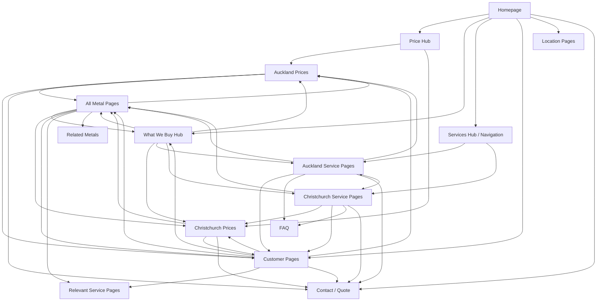

# Scrap Mart Internal Linking Architecture

Status: implementation plan for the current rebuild.
Last updated: 13 July 2026.

This file defines the internal linking structure to use across the Scrap Mart website rebuild. It reflects the newer page structure used in the homepage preview and the current page-content work, while keeping the older live customer URLs visible for redirect and migration planning.

## Architecture Goals

- Make prices easy to reach from every commercial, service, metal, and customer page.
- Give Auckland and Christchurch equal weight across services, prices, and local conversion paths.
- Keep `What We Buy` as the main hub for accepted metals and grades.
- Support commercial and tradie enquiries without burying household drop-off information.
- Use links that help real users decide what to do next, not generic "related page" blocks.
- Avoid bin services, solar panel recycling, car bodies, car engines, and machinery targeting.

## Primary Navigation

```text
Home
├── Prices
│   ├── Auckland Prices
│   └── Christchurch Prices
├── What We Buy
│   ├── Copper
│   ├── Copper Wire And Cable
│   ├── Aluminium
│   ├── Batteries And Lead
│   ├── Brass
│   ├── Stainless Steel
│   ├── Steel And Iron
│   ├── Motors And Compressors
│   ├── Radiators
│   ├── Air Conditioners And Heat Pumps
│   ├── Hot Water Cylinders
│   └── Zinc
├── Services
│   ├── Scrap Metal Buyers
│   │   ├── Auckland
│   │   └── Christchurch
│   ├── Scrap Metal Collection
│   │   ├── Auckland
│   │   └── Christchurch
│   ├── Commercial Scrap Buyers
│   │   ├── Auckland
│   │   └── Christchurch
│   └── Battery Recycling
│       ├── Auckland
│       └── Christchurch
├── Customers
│   ├── Household Scrap
│   ├── Commercial Scrap
│   └── Tradie Scrap
├── Locations
│   ├── Auckland
│   └── Christchurch
├── About
├── Contact
└── Blog
```

FAQ should sit in the footer and in contextual page sections, not the primary navigation.

## Canonical URL Map

### Core Pages

| Page | URL | Role |
| --- | --- | --- |
| Home | `/` | Brand, trust, price access, main enquiry paths |
| About | `/about` | Company story, proof, founder context |
| Contact | `/contact` | Branch contact, quote form, enquiry routing |
| Blog | `/blog` | Resource and SEO support content |
| Gallery | `/gallery` | Yard, team, process, material proof |
| FAQ | `/faq` | Support page linked from footer and relevant pages |
| Privacy Policy | `/privacy-policy` | Footer legal page |
| Terms & Conditions | `/terms-conditions` | Footer legal page |

### Price Pages

| Page | URL | Role |
| --- | --- | --- |
| Price Hub | `/scrap-metal-prices` | Price entry point, location choice, pricing disclaimer |
| Auckland Prices | `/scrap-metal-prices/auckland` | Auckland price table and enquiry path |
| Christchurch Prices | `/scrap-metal-prices/christchurch` | Christchurch price table and enquiry path |

### Service Pages

| Service | Auckland URL | Christchurch URL |
| --- | --- | --- |
| Scrap Metal Buyers | `/services/scrap-metal-buyers/auckland` | `/services/scrap-metal-buyers/christchurch` |
| Scrap Metal Collection | `/services/scrap-metal-collection/auckland` | `/services/scrap-metal-collection/christchurch` |
| Commercial Scrap Buyers | `/services/commercial-scrap-buyers/auckland` | `/services/commercial-scrap-buyers/christchurch` |
| Battery Recycling | `/services/battery-recycling/auckland` | `/services/battery-recycling/christchurch` |

### Customer Pages

| Customer Type | Preferred New URL | Existing Live URL To Preserve Or Redirect |
| --- | --- | --- |
| Household Scrap | `/customers/household-scrap` | `/household-scrap-metal-drop-off-auckland` |
| Commercial Scrap | `/customers/commercial-scrap` | `/commercial-scrap-metal-auckland` |
| Tradie Scrap | `/customers/tradie-scrap` | `/tradie-scrap-metal-auckland` |

If the rebuild keeps the existing live URLs for customer pages, use those as canonical and redirect the `/customers/...` paths. Do not split equity between both versions.

### What We Buy Pages

| Metal Page | URL |
| --- | --- |
| What We Buy Hub | `/what-we-buy` |
| Copper | `/what-we-buy/copper` |
| Copper Wire And Cable | `/what-we-buy/copper-cable` |
| Aluminium | `/what-we-buy/aluminium` |
| Batteries And Lead | `/what-we-buy/batteries` |
| Brass | `/what-we-buy/brass` |
| Stainless Steel | `/what-we-buy/stainless-steel` |
| Steel And Iron | `/what-we-buy/steel-and-iron` |
| Motors And Compressors | `/what-we-buy/electric-motors` |
| Radiators | `/what-we-buy/radiators` |
| Air Conditioners And Heat Pumps | `/what-we-buy/air-conditioners-heat-pumps` |
| Hot Water Cylinders | `/what-we-buy/hot-water-cylinders` |
| Zinc | `/what-we-buy/zinc` |

## Visual Internal Link Model



## Page-Level Linking Rules

### Homepage

Link to:

- Auckland and Christchurch price pages.
- What We Buy hub.
- High-value metal pages: Copper, Copper Cable, Batteries And Lead, Aluminium, Brass, Stainless Steel, Steel And Iron, Motors And Compressors, Radiators.
- Main service pages for both cities where the section context supports it.
- Household Scrap, Commercial Scrap, and Tradie Scrap as customer paths.
- Auckland and Christchurch location pages.
- Contact or quote form.

### Price Pages

Every price page should link to:

- What We Buy hub.
- All metal pages.
- Household Scrap, Commercial Scrap, and Tradie Scrap.
- Same-city service pages.
- Contact or quote form.
- The other city price page as a location switcher.

The price hub should link to both city price pages, What We Buy, key metals, and Contact.

### Service Pages

Every Auckland service page should link to:

- Auckland Prices.
- All metal pages.
- Household Scrap, Commercial Scrap, and Tradie Scrap.
- FAQ.
- Contact.
- All other Auckland service pages.
- The matching Christchurch service page as the location switcher.

Every Christchurch service page should link to:

- Christchurch Prices.
- All metal pages.
- Household Scrap, Commercial Scrap, and Tradie Scrap.
- FAQ.
- Contact.
- All other Christchurch service pages.
- The matching Auckland service page as the location switcher.

Service page links should feel like practical next steps. Use headings such as "More Auckland Scrap Metal Services" or "Need Another Scrap Option?" instead of generic labels like "internal links".

### Metal Pages

Every metal page should link to:

- What We Buy hub.
- Auckland Prices.
- Christchurch Prices.
- Relevant service pages.
- Household Scrap, Commercial Scrap, and Tradie Scrap.
- Related metals at the bottom.
- Contact or quote form where the material may need checking, grading, or volume discussion.

Relevant service examples:

- Copper, Copper Cable, Aluminium, Brass, Stainless Steel, Steel And Iron, Motors And Compressors, Radiators, Hot Water Cylinders, Zinc: link to Scrap Metal Buyers, Scrap Metal Collection, and Commercial Scrap Buyers pages for both cities where useful.
- Batteries And Lead: link to Battery Recycling pages for both cities, both price pages, all customer pages, FAQ, and Contact.
- Air Conditioners And Heat Pumps: link to Scrap Metal Buyers, Scrap Metal Collection, Commercial Scrap Buyers, and relevant customer pages. Avoid claiming gas or refrigerant handling unless confirmed.

### What We Buy Hub

Link to:

- Every metal page.
- Auckland Prices and Christchurch Prices.
- All Auckland service pages.
- All Christchurch service pages.
- Household Scrap, Commercial Scrap, and Tradie Scrap.
- FAQ or prohibited-items guidance.
- Contact.

### Customer Pages

#### Household Scrap

Link to:

- What We Buy hub.
- Commercial Scrap and Tradie Scrap.
- Scrap Metal Buyers Auckland.
- Scrap Metal Buyers Christchurch.
- Battery Recycling Auckland.
- Battery Recycling Christchurch.
- Auckland Prices and Christchurch Prices where pricing helps the household user decide whether to visit.
- Contact.

Do not lead the page with commercial collection language. Keep the focus on accepted household metal, household appliance drop-off, what to bring, what is not accepted, and branch choice.

#### Commercial Scrap

Link to:

- What We Buy hub.
- Household Scrap and Tradie Scrap.
- Commercial Scrap Buyers Auckland.
- Commercial Scrap Buyers Christchurch.
- Scrap Metal Buyers Auckland.
- Scrap Metal Buyers Christchurch.
- Battery Recycling Auckland.
- Battery Recycling Christchurch.
- Relevant metal pages.
- Auckland Prices and Christchurch Prices.
- Contact.

Commercial Scrap should not be confused with household drop-off. The emphasis should be repeat supply, larger loads, business scrap, weighing, grading, and payment.

#### Tradie Scrap

Link to:

- What We Buy hub.
- Household Scrap and Commercial Scrap.
- All service pages.
- Auckland Prices and Christchurch Prices.
- Relevant metal pages, especially Copper, Copper Cable, Aluminium, Stainless Steel, Steel And Iron, Motors And Compressors, Air Conditioners And Heat Pumps, and Hot Water Cylinders.
- Contact.

## Recommended Section Names

Use human section headings instead of implementation language.

| Avoid | Use Instead |
| --- | --- |
| Internal linking suggestions | Helpful next steps |
| Relevant service pages | More Auckland Scrap Metal Services |
| Other customer pages | Choose the right customer path |
| Related links | You may also need |
| Location switcher | Selling in Christchurch? / Selling in Auckland? |

## CTA Rules

- Hero sections should use no more than two primary CTAs.
- Price pages should prioritise "View Auckland Prices", "View Christchurch Prices", "Get a Quote", or "Call".
- Service pages should include one quote/enquiry CTA and one phone/location CTA.
- Metal pages should include "View Prices" and "Get a Quote" where relevant.
- Customer pages should use practical CTAs such as "Ask About Drop-off", "View Accepted Metals", "Check Prices", or "Send Enquiry".

## Footer Links

Footer should include:

- Auckland Prices.
- Christchurch Prices.
- What We Buy.
- Services.
- Household Scrap.
- Commercial Scrap.
- Tradie Scrap.
- Auckland location.
- Christchurch location.
- FAQ.
- Gallery.
- Blog.
- Contact.
- Privacy Policy.
- Terms & Conditions.

## Migration Notes

- Keep existing live customer URLs either as canonical URLs or as 301 redirects to the new customer paths.
- Keep price and service URL formats consistent. Do not mix `/auckland/scrap-prices/` with `/scrap-metal-prices/auckland` unless redirects are in place.
- If a shorter metal URL set is required later, such as `/copper` instead of `/what-we-buy/copper`, pick one canonical structure and redirect the other.
- E-waste can remain a secondary or POA support page if needed, but should not be featured in homepage navigation or main service cards.
